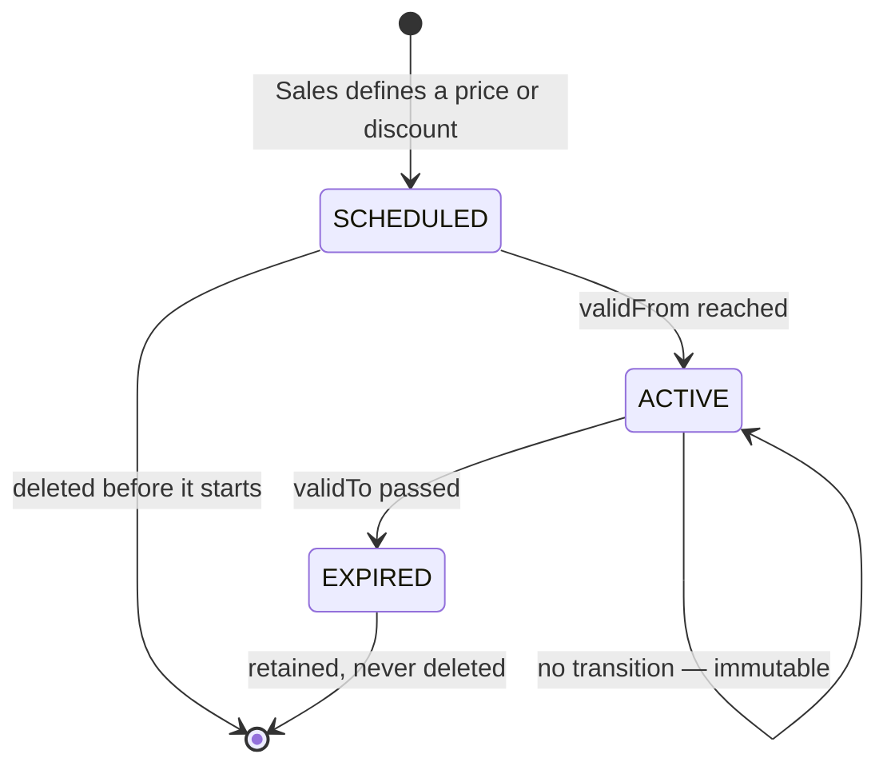

# Element 08 — Price lifecycle

The state model of `Price` and `Discount` (element 04 §8). Both share one lifecycle, so this
element covers them together.

## States

```text
PriceState = SCHEDULED | ACTIVE | EXPIRED
```

| State | Meaning | Editable |
|---|---|---|
| `SCHEDULED` | defined for a date range that has not started | **yes** |
| `ACTIVE` | the range covers today | no |
| `EXPIRED` | the range has ended | no |

## The lifecycle is driven by the calendar, not by an actor



| # | Transition | Trigger | Actor | Emits |
|---|---|---|---|---|
| T1 | *(none)* → `SCHEDULED` | Sales defines an entry | Sales | `product prices changed` |
| T2 | `SCHEDULED` → `ACTIVE` | `validFrom` reached | clock | `product prices changed` |
| T3 | `ACTIVE` → `EXPIRED` | `validTo` passed | clock | — |
| T4 | `SCHEDULED` → *(deleted)* | Sales deletes the entry | Sales | `product prices changed` |
| T5 | `SCHEDULED` → `SCHEDULED` | Sales edits amount/percent/range | Sales | `product prices changed` |
| T6 | `ACTIVE` → `ACTIVE` | — | — | **no transition exists** |
| T7 | `EXPIRED` → `expired` | — | — | **no transition exists** — retained for audit |

## State is derived, never stored

```text
stateAt(entry, date) =
    SCHEDULED  if date <  validFrom
    ACTIVE     if date is within [validFrom, validTo)      (open-ended validTo = ∞)
    EXPIRED    otherwise
```

This removes calendar drift: a stored `ACTIVE` that nobody sweeps would silently keep paying
out at an old price. The API's `state` field (element 02) is this function applied to the
business date (**Q32**).

## Condition diff — one entry over time

```diff
 priceId: pr-2
 stateAt: 2019-06-15
-state: SCHEDULED
+state: ACTIVE
```

```diff
 priceId: pr-2
 stateAt: 2019-07-01
-state: SCHEDULED
+state: ACTIVE
```

```diff
 priceId: pr-1          # validFrom 2019-06-01, validTo 2019-06-30
 stateAt: 2019-06-30
-state: ACTIVE
+state: EXPIRED
```

## Scenario table

Reference entries for `p-2019-0442`:

| entry | kind | validFrom | validTo |
|---|---|---|---|
| `pr-1` | PRICE | 2019-06-01 | 2019-06-30 |
| `pr-2` | PRICE | 2019-07-01 | *(open)* |
| `pr-3` | DISCOUNT | 2019-07-01 | 2019-07-31 |

| # | business date | `pr-1` | `pr-2` | `pr-3` | editable |
|---|---|---|---|---|---|
| 1 | 2019-05-31 | `SCHEDULED` | `SCHEDULED` | `SCHEDULED` | `pr-1`, `pr-2`, `pr-3` |
| 2 | 2019-06-01 | `ACTIVE` | `SCHEDULED` | `SCHEDULED` | `pr-2`, `pr-3` |
| 3 | 2019-06-30 | `ACTIVE` | `SCHEDULED` | `SCHEDULED` | `pr-2`, `pr-3` |
| 4 | 2019-07-01 | `EXPIRED` | `ACTIVE` | `ACTIVE` | none |
| 5 | 2019-07-31 23:59 | `EXPIRED` | `ACTIVE` | `ACTIVE` | none |
| 6 | 2019-08-01 | `EXPIRED` | `ACTIVE` | `EXPIRED` | none |

Row 4 is the boundary that shows both rules at once: `validTo` is **exclusive** (RULE-38), so
`pr-1` is already `EXPIRED` on 1 July while `pr-2` and `pr-3` are `ACTIVE`.

## Domain rules

RULE-26, RULE-27 and RULE-28 are defined once, in element 04 §8. In short:

- RULE-26 — a `SCHEDULED` entry is editable and deletable; `ACTIVE` and `EXPIRED` are immutable.
- RULE-27 — an entry is `ACTIVE` only while its range covers the business date; the state is never a stored field.
- RULE-28 — `product prices changed` is emitted when an entry becomes `ACTIVE`.

- RULE-64: a `SCHEDULED` entry may be deleted; `ACTIVE` and `EXPIRED` are retained forever.
- RULE-65: at most one `Price` and one `Discount` are `ACTIVE` at any instant (follows from RULE-25).
- RULE-66: re-defining an entry that is `SCHEDULED` edits it in place; a change to an `ACTIVE` entry means defining a *new* entry for a future range.
- RULE-67: the business date comes from the `Clock` bean's zone, the same source as `Audit.at` (element 04 RULE-62, Q36).

## Open

- **Q32** — settled as deviation **D2** in `prototypes/domain-model-java.md` §4: derived `stateAt(businessDate)`, specified in this element.
- **Q18** — the no-overlap rule and rounding that make T2/T3 well-defined at boundaries.
- **Q36** — the `Clock` zone.
- **Q37** — who emits `product prices changed` at T2/T3: a scheduler job inside this context, or is the transition purely read-time with the event emitted lazily on first read? RULE-28 assumes a scheduler.
