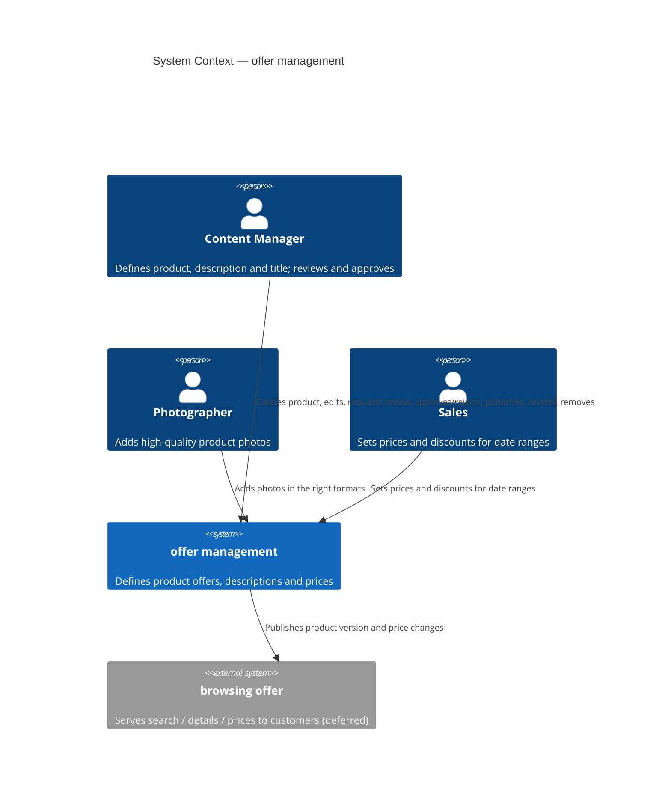

# Spec — offer management

- **Ticket:** [michal-michaluk/ecommerce-ai#2](https://github.com/michal-michaluk/ecommerce-ai/issues/2)
- **Slug:** `offer-management`
- **Status:** Steps 1–5 complete, Step 6 review applied — all elements specified, element 09 adopted as a fixed constraint
- **Target stack:** Java 25 / Spring Boot 4.0.6 / Gradle, hexagonal (ports & adapters) — blueprint `microservice-java-spring`

---

## 1. Goals

- **We build:** `offer management` — product offer definition, description workflow and pricing.
- **For whom:** Content Manager · Photographer · Sales.
- **Because:** streamline offer/description creation; guarantee high-quality published descriptions.
- **Success looks like:** no measurable target in this increment.

Naming: the event-storming board's term **`offer management`** is the ubiquitous name (the
transcript's "product catalog management" is a synonym and is not used).

## 2. Actors

| Actor | Type | Intent |
|---|---|---|
| Content Manager | person | Defines product, description and title; reviews and approves descriptions |
| Photographer | person | Adds high-quality product photos |
| Sales | person | Sets prices and discounts for date ranges |
| `browsing offer` | external system (deferred microservice) | Consumes published product version and price changes |

Separation of duties is a rule, not an actor: a description is reviewed and approved by a
**different person** than its author.

## 3. Capabilities

| # | Capability |
|---|---|
| C1 | `create new product` → produces a blank draft |
| C2 | `edit description / title` |
| C3 | `add photo` in the right formats |
| C4 | `request review` |
| C5 | `review and approve` a description (quality gate) |
| C6 | `publish version to offer` |
| C7 | `revert to previous version` |
| C8 | `remove product from offer` |
| C9 | `set prices and discounts` valid for date ranges |
| C10 | `serve search / product details / prices` to the shop — by publishing events, not by a query API |

## 4. Properties

| # | Property |
|---|---|
| P1 | Continuous feedback — what is missing is shown from the blank draft onward |
| P2 | Publish quality gate — never publish with an open policy issue; a missing field may be overridden to *request* review, never to publish |
| P3 | Scheduled effect — publication and price changes take effect on a future date, not immediately |
| P4 | Version + snapshot — the published description snapshot is retained; revert restores a previous version |
| P5 | Separation of duties — review is performed by another person |
| P6 | Read models always available, scaled for seasonal peaks |
| P7 | Photos may be own or vendor photos, possibly AI-processed |

## 5. System context (C4)

## 6. Current state (Step 3)

| Area | Status | Where | Reuse |
|---|---|---|---|
| Java source / build files | missing entirely | no `*.java`, `*.kt`, `*.gradle`, `pom.xml` | build new |
| Domain model, aggregates, value objects | missing | — | build new |
| API contract / OpenAPI | missing | — | build new |
| Persistence / projections | missing | — | build new |
| UI surfaces | missing | — | build new |
| Architecture rules & patterns | exists | `docs/arch/microservice-java-spring/index.md`, `ports.md`, `domain-model.md`, `policy.md`, `code-structure.md`, `arch-unit.md` | reuse as-is |
| Bounded-context procedure | exists | `docs/arch/microservice-java-spring/adding-a-bounded-context.md` | reuse as-is |
| Blueprint catalog | exists | `.agents/blueprints/index/blueprints.json` | reuse |

The repository is unscaffolded: every element is *build new*; the only reuse is architectural.

## 7. Materials

See [`materials/README.md`](materials/README.md).

## 8. Scope

**In scope** — the `offer management` bounded context: C1–C10, P1–P7.

**Deferred** — detached to their own specs, cross-linked from #2:

| Spec | Ticket |
|---|---|
| browsing offer | [#3](https://github.com/michal-michaluk/ecommerce-ai/issues/3) |
| basket management | [#4](https://github.com/michal-michaluk/ecommerce-ai/issues/4) |
| checkout process | [#7](https://github.com/michal-michaluk/ecommerce-ai/issues/7) |
| fulfilment (order processing) | [#5](https://github.com/michal-michaluk/ecommerce-ai/issues/5) |
| external integration ports (warehouse, CRM, delivery providers) | [#6](https://github.com/michal-michaluk/ecommerce-ai/issues/6) |

**Out of scope** — payment.

## 9. Elements

Step 5 processes these in order. Each becomes `NN-<element>.md`.

| # | Element | Type | File | Status |
|---|---|---|---|---|
| 01 | UI mockup — offer management screens | UI view | [01-ui-mockup.md](01-ui-mockup.md) | **specified** |
| 02 | Frontend API — the HTTP contract the UI calls | API surface | [02-frontend-api.md](02-frontend-api.md) | **specified** |
| 03 | `offer management ↔ browsing offer` — published events + search/details/prices surface | component integration | [03-browsing-offer-integration.md](03-browsing-offer-integration.md) | **specified** |
| 04 | Offer domain model — Product, Product Description, Photo, Product Price, Discount, Offer availability, Review + description lifecycle | business concepts + state model | [04-offer-domain-model.md](04-offer-domain-model.md) | **specified** |
| 05 | review completeness — draft + rules → missing fields | calculation | [05-review-completeness.md](05-review-completeness.md) | **specified** |
| 06 | effective price — prices + discounts + an instant → the active price | calculation | [06-effective-price.md](06-effective-price.md) | **specified** |
| 07 | Offer management decisions — quality policy, publish guard, review request guard, publication timing, separation of duties | automated decisions | [07-decisions.md](07-decisions.md) | **specified** |
| 08 | Price lifecycle — scheduled → active → expired | state model | [08-price-lifecycle.md](08-price-lifecycle.md) | **specified** |
| 09 | Blueprint adoption — Java 25 / Spring Boot 4.0.6 / hexagonal, ArchUnit gates | technology | *none — constraint* | **adopted as-is** — not specified, not adjusted |

**Element 09 is not specified.** `docs/arch/microservice-java-spring/` is a **fixed
constraint**: the implementation follows it unchanged, so there is nothing to design, nothing
to detach and no `poc`. Every other element is specified **within** that blueprint.

Collapsed by operator decision: the former UI/view elements 01–09 (one per actor action) →
**01 UI mockup** + **02 Frontend API**; concepts 12–18 + description lifecycle 26 →
**04 Offer domain model**; decisions 21–25 → **07 Decisions** (one file, every decision
specified). The `browsing offer` query surface + published events were merged into **03**.

## 10. Registers

| ID | Type | Statement | Status | Decision |
|---|---|---|---|---|
| F1 | Finding | Repository is unscaffolded — no application code, only architecture docs | accepted | every element is build new |
| F2 | Finding | Catalog supplies search/details/prices; stock comes from the warehouse system (transcript seg. 54–56) | accepted | `offer management` owns no external port |
| F3 | Finding | CRM is fed at checkout, the carrier at fulfilment — offer management is not involved | accepted | no CRM/carrier port in this context |
| F4 | Finding | Publication and price changes are scheduled, not immediate (seg. 35–48) | accepted | availability/effective date is a first-class concept |
| F5 | Finding | Two stated goals: streamline creation; high-quality descriptions (seg. 30–31) | accepted | both drive the quality gate |
| F6 | Finding | hurl matches an inline JSON body **exactly**, not as a subset (verified on hurl 7.1.0 against a local server) | accepted | full response shapes live in `prototypes/frontend-api.responses.md`; `.hurl` keeps executable assertions |
| R6 | Risk | The blueprint stack (Java 25 / Spring Boot 4.0.6) is new technology for this repository | **closed** | the blueprint is adopted **unchanged** as a constraint — no adjustment, no `poc`, no element 09 |
| R7 | Risk | The skill's `verify-storybook.cdp.js` cannot drive Storybook 8/10 (sidebar anchors gone; content checked on the manager page instead of the preview iframe) | accepted | local equivalent gate `.storybook/verify-storybook.cjs` |
| R8 | Risk | Storybook 10 + `@storybook/html-vite` fails in isolated mode (`404 virtual:/@storybook/builder-vite/vite-app.js`) | accepted | use the reference's isolated stack: Storybook 8.6.14 + `@storybook/html-webpack5` + `addon-essentials` |
| Q15 | Question | Success metric (baseline → target within timeframe) | answered | no measurable target in this increment |
| Q16 | Question | Is the reviewer a distinct actor? | answered | one `Content Manager` actor; separation of duties is a rule |
| Q17 | Question | Read models: an API we expose, or events the shop projects itself? | **proposed** | events only — the shop owns its read models; `GET /products` here is the admin surface |
| Q18 | Question | Pricing units, currency and rounding | **proposed** | currency is an attribute of each Price (ISO-4217, example PLN); `percent` is a decimal string in `(0,100)`; rounding `HALF_UP` to 2 decimals, applied once to the final result; ranges of the same kind never overlap per product |
| Q20 | Question | The mockup-invented specifics | **proposed** | keep all four requirements (title, description, photo, price) — each is transcript-grounded (seg. 5 title, seg. 17 photo in the description, seg. 27 "all the mandatory fields", seg. 41 "in the catalog we need prices"); keep "request review with missing items, publish only when complete" (seg. 33); keep the six **derived** state names — these are **invented**, not transcript-grounded, and cost nothing structural because they are derived (RULE-34); replace fixed `PLN` with a currency attribute |
| Q21 | Question | Photo constraints | **proposed** | `image/jpeg` + `image/png`, min 1000×1000 px, max 10 MiB |
| Q22 | Question | Is `GET /products` the admin surface or the `browsing offer` surface? | **proposed** | the admin surface of this context |
| Q23 | Question | `GET /product-photo-formats` endpoint, or a UI constant? | **proposed** | keep as an endpoint — the server owns the format policy |
| Q24 | Question | Language of the admin UI; is the Allegro layout normative? | **proposed** | admin UI Polish, code and API English; nothing from the Allegro layout is normative |
| Q25 | Question | Element-01 catalog rows violate the `OfferState` precedence | **answered** | fixed — the catalog now shows one row per state, `BLOCKED` was tightened by RULE-70, the gate re-ran green and the screenshots were re-shot |
| Q26 | Question | May a `SCHEDULED` publication be cancelled? | **proposed** | in scope — `DELETE /products/{productId}/publications/{publicationId}`, `SCHEDULED` only |
| Q27 | Question | Is the advisory text check in this increment? | **proposed** | in scope as an advisory-only **port** with a null-object default (`issues = []` when no checker is configured) |
| Q28 | Question | Is `Completeness` stored or computed on read? | **proposed** | stored projection `ProductCompleteness` (blueprint `adapter-projection.md`); the read DTO carries the projection's output, and `05-review-completeness.md` remains the definition |
| Q29 | Question | May a reviewer be delegated or replaced? | **proposed** | no delegation in this increment — the deciding subject is the authenticated identity |
| Q30 | Question | Is an amount-type discount needed, or percent only? | **proposed** | percent only in this increment |
| Q31 | Question | Where does `Product` (Process) live, spanning `draft`, `offer`, `pricing`? | **proposed** | mediator adapter package (blueprint `adapter-mediator.md`) |
| Q32 | Question | Is `Price.state` derived from the calendar or stored and swept? | **proposed** | derived `stateAt(businessDate)` — removes drift (decided as D2 in `prototypes/domain-model-java.md` §4; `08-price-lifecycle.md` specifies the derivation) |
| Q33 | Question | Is `Completeness` handed to the draft snapshot, or queried through a shared port? | **proposed** | handed in by the service; `draft` never imports `Price` |
| Q34 | Question | A decided `ReviewRequest` overwrites `at`, losing `submittedAt` | **proposed** | keep the 4-tuple; the projection keeps `submittedAt` from `DescriptionPendingReview` |
| Q35 | Question | `Audit` in read models — expose `updatedBy`? | **proposed** | yes — `updatedBy` is present beside `updatedAt` in `prototypes/frontend-api.responses.md` (Product and DescriptionDraft) |
| Q36 | Question | The `Clock` zone behind `Audit.at` vs the pricing business date | **proposed** | pin one zone in `AppConfiguration`; both read it |
| Q37 | Question | Who emits `product prices changed` when an entry becomes ACTIVE? | **proposed** | a scheduler job inside the pricing context |
| Q38 | Question | Event transport to `browsing offer`: broker or outbox poll? | **proposed** | outbox table + poller — no new adapter type, stays inside the blueprint |
| Q39 | Question | Does the shop need `DescriptionReverted`? | **proposed** | no — revert only creates a draft, nothing projected changes |
| Q40 | Question | Deviations from the fixed blueprint in the Java model | **answered** | **D1 kept** — no `Clock` in any aggregate; operations carry `Audit(who, at)`, the business date is resolved before the call. **D2 kept** — `Price` is its own aggregate, independent of the draft, and resolved at publication / read. **D3 kept as a declared exception** — `Completeness` is handed in, because computing it inside the draft would break `adapter-mediator.md` |
| R4 | Risk | Partly legible board annotation near `publish version to offer` | **proposed** | proceed without it — no element depends on it |
| R9 | Risk | Deviation D3 (`Completeness` handed in) contradicts an explicit blueprint rule (`domain-model.md`) | **accepted** | declared exception with rationale in `prototypes/domain-model-java.md` §4; both alternatives break a blueprint rule |

## 11. Value and Done

### Definition of Value

No measurable target in this increment (Q15) — the goal statement in §1 is unchanged.

The **implementation** increment must produce one: `target metric (baseline → target) within
timeframe`. Leading candidate from the two stated goals (transcript seg. 30–31) — *streamline
creation* and *high-quality descriptions*: **share of drafts reaching `PUBLISHED` without a
rejection round, baseline → target within 60 days**.

### Definition of Done — the specification increment

Evidence, not intent. One row = one executable check + one observable expectation.
Run: `docs/specs/offer-management/check-spec.sh [storybook-url]` — exits non-zero unless every
row passes.

| # | Facet | Check (executable) | Expected | Observed |
|---|---|---|---|---|
| D1 | Artifact | `check-spec.sh` → `index_missing_or_orphan` | `0` | 0 |
| D2 | Contract | → `rule_duplicates` | `0` | 0 |
| D3 | Contract | → `rule_gaps` | `0` | 0 |
| D4 | Contract | → `rule_undefined` | `0` | 0 |
| D5 | Contract | → `broken_links` | `0` | 0 |
| D6 | Contract | → `unparseable_blocks` | `0` | 0 |
| D7 | Contract | → `undeclared_error_codes` | `0` | 0 |
| D8 | Contract | `hurlfmt --check prototypes/frontend-api.hurl` | exit `0` | 0 |
| D9 | Contract | `grep -cE '^HTTP ' prototypes/frontend-api.hurl` | `41` | 41 |
| D10 | Artifact | `ls prototypes/ui-mockups/*.png \| wc -l` | `9` | 9 |
| D11 | Gate | `node .storybook/verify-storybook.cjs <url>` | `9/9` stories, `4/4` flows, `QUALITY GATE PASSED` | passed |
| D2N | Failure | append a second definition of an existing rule → `rule_duplicates` | `≥ 1` | 1 |
| D5N | Failure | append a markdown link to a file that does not exist → `broken_links` | `≥ 1` | 1 |
| D6N | Failure | append a fenced JSON block that does not parse → `unparseable_blocks` | `≥ 1` | 1 |
| D7N | Failure | append a decision-table row denying with an undeclared code → `undeclared_error_codes` | `≥ 1` | 1 |
| D0N | No false green | all four twins removed → every failure count back to `0` | `0` | 0 |

The `N` rows are the point of the gate: each one mutates the real folder through a scratch file,
proves the corresponding check **fails**, then removes it. A check that cannot fail proves nothing.

`12 passed / 0 failed`, exit `0`, at the time of writing.

### Definition of Done — the implementation increment

Cannot execute yet — no application code exists (§6). Rows are **moved**, never deleted.

| # | Facet | Check (executable) | Expected |
|---|---|---|---|
| I1 | Artifact | `scaffold generate microservice-java-spring` + `./gradlew build` | container starts, arch tests included |
| I2 | Contract | `hurl --test --variable BASE_URL=… prototypes/frontend-api.hurl` | 41 pairs: 25 `2xx`, 16 `4xx` |
| I3 | Failure | the 16 error pairs of the `.hurl` | each returns its declared code and status |
| I4 | No false green | publish a product through the API with no price defined | `422 PUBLICATION_BLOCKED` with `details.blocking` |
| I5 | Gate | ArchUnit `ArchitectureOf{Context}Test` for each context | green, no rule weakened |
| I6 | Integration | an event reaches the `browsing offer` consumer and its read model updates | read model reflects the published version |
| I7 | Value | share of drafts reaching `PUBLISHED` without a rejection round, baseline → target within 60 days | metric moves off baseline |

---

## Implementation Plan

> Status: **proposed** (planning session). The implementation DoD (`I1–I7`, §11) has landed and
> is the acceptance contract below; the specification increment gate (`check-spec.sh`) is green.
> Operator decisions folded in: **A14** k3s on podman, **A15** PostgreSQL document-with-history,
> **A16** in-cluster Postgres.

### Available Infrastructure

| Facet | Tooling |
|---|---|
| Build | Gradle 9.5.1 wrapper (scaffold `microservice-java-spring`), Java 25 toolchain |
| Test | JUnit 5 + AssertJ · ArchUnit 1.4.2 · Testcontainers 2.0.5 (PostgreSQL, Kafka, Keycloak) · Pact 4.7.3 |
| Static | SpotBugs 4.9.8 + findsecbugs · PIT 1.25.4 · JaCoCo 0.8.15 (`guardrail_mode=strict`) |
| Security scan | Trivy (`trivyScan`, `trivyScanImage`) |
| e2e | hurl (blueprint `e2e/`, pattern `example/e2e/devices.hurl`) |
| Runtime | **podman 6.1.0** only — no docker daemon (`docker` on PATH is a podman shim); k3d is out |
| Image | `jibBuildTar` (OCI tar) + `podman load`, then imported into k3s containerd (`podman save | podman exec <k3s> ctr -n k8s.io images import -`) — `jibDockerBuild` cannot run |
| Persistence | PostgreSQL + **document-with-history** (JSONB snapshot + events table) — blueprint `adapter-persistence-document.md` |
| Deploy | **k3s in a privileged podman container** (no k3d, no docker): `podman run -d --privileged --name offer-management-k3s --cgroupns=host -p 6443:6443 -p 8080:80 rancher/k3s:v1.35.5-k3s1 server`; kubeconfig from `/etc/rancher/k3s/k3s.yaml`. The blueprint ships **no** k3s deploy script/overlay (`k8s/overlays/{dev,k3d}` only) — `deploy-k3s` authors it and renames the in-cluster overlay to `k8s/overlays/k3s` |
| Spec gate | `docs/specs/offer-management/check-spec.sh` (12 rows, green) |
| Verification skills | `review` (+ complexity / tests / arch / security / spec-coverage), `demo`, `contract-testing`, `sqt` |
| Architecture docs | `docs/arch/microservice-java-spring/` — `index.md` is the mandatory workflow |

Project directory `offer-management/` (A1); package root `com.example.offer`.
G0–G6 = `./gradlew test` → `./gradlew spotbugsMain trivyScan pitest jibBuildTar` → `./gradlew jacocoTestCoverageVerification` (trivy/jib adapted to podman in `build-gates`).

**Gate policy (operator decision, A18):** every node gate runs the **tests** (`./gradlew test … --no-daemon`) — never `./gradlew build -x test` (that excludes the `test` task, so JaCoCo verification is SKIPPED and ArchUnit — which runs inside `test` — never executes: a false green, which is exactly how the broken `ArchitectureTest` slipped past `scaffold-service`). Coverage is **not** a per-node gate: `jacocoTestCoverageVerification` runs as its own gate once the domain is implemented, scoped to `draft` / `pricing` / `offer`. `tools/` and the framework wiring need no coverage.

### Clarification Decisions (A1–A13 assumptions; A14–A17 operator decisions)

| # | Question | Assumption taken |
|---|---|---|
| A1 | Where does the service live? | `offer-management/` at repo root; Gradle project root there |
| A2 | Spec acceptance (ticket #2 open) | plan proceeds against the register as-is; every `proposed` item treated as accepted input |
| A3 | Baseline commit | `docs/`, `.agents/`, `.storybook/`, `prototypes/` and the `.gitignore` change are committed on `feat/offer-management` in `scaffold-service` before any code |
| A4 | Deliverable scope | the **Java microservice only**; element-01 stays a Storybook prototype (no real frontend) |
| A5 | Overlap rejection (F1) | new code `PRICE_OVERLAP` → `409`, enforced by the `PriceSchedule` guard (RULE-25); E02 error table gets a row |
| A6 | Cancellation (Q26) | `DELETE /products/{productId}/publications/{publicationId}`, `SCHEDULED` only → `204`; a new Publication state `CANCELLED`, never a delete (RULE-33) |
| A7 | Advisory issues (Q27) | `issues[]` exposed beside `completeness` on the draft and review-detail responses; null-object port → `[]` |
| A8 | `Completeness` (Q28/Q33) | stored projection `ProductCompleteness` (blueprint `adapter-projection.md`); the read DTO carries its output; `05-review-completeness.md` remains the definition |
| A9 | Clock (Q36) | one zone pinned in `AppConfiguration`; business date resolved in the service/mediator and passed in; **no aggregate holds a `Clock`** (RULE-69) |
| A10 | Price transitions (Q32/Q37) | state stays **derived** `stateAt(date)`; a `pricing` scheduler emits `ProductPricesChanged` once per entry on `SCHEDULED→ACTIVE` |
| A11 | Transport (Q38) | transactional outbox + relay to **Kafka** (blueprint ships `spring-kafka`), partition key `productId`, `_v1` types — Q38's bare poller cannot guarantee the per-`productId` ordering E03 requires |
| A12 | Pact | **no Pact** — the `browsing offer` boundary is Kafka events, not HTTP, and there is no frontend app; event payload proven by a stub-consumer test + hurl for the admin surface |
| A13 | Spring Boot version | template pins Spring Boot **4.1.0** while R6/§6 say 4.0.6; the generated template governs (blueprint adopted as-is) |
| A14 | Deployment target (operator) | **k3s in a privileged podman container, no k3d, no docker** — `podman run -d --privileged --name offer-management-k3s --cgroupns=host -p 6443:6443 -p 8080:80 rancher/k3s:v1.35.5-k3s1 server`; kubeconfig at `/etc/rancher/k3s/k3s.yaml`. Entire solution stays on `microservice-java-spring`; the deploy script is authored by us because the blueprint has none |
| A15 | Persistence style (operator) | **PostgreSQL + document-with-history** for every aggregate repository (JSONB snapshot + separate events table, `@Version` optimistic lock, events published after save) per `adapter-persistence-document.md`; read models via `adapter-projection.md` |
| A16 | Postgres in-cluster | no Postgres manifest ships — deploy **bitnami/postgresql via Helm** with the service name the overlay expects |
| A17 | Container runtime everywhere | every container operation is **podman**: trivy (`podman run`), image build (`jibBuildTar` + `podman load`), cluster (`podman run`) |
| A18 | Test + coverage policy (operator) | node gates run `test`, never `build -x test`; `jacocoTestCoverageVerification` is a **separate, later** gate (after the domain is implemented) scoped to the `draft` / `pricing` / `offer` contexts; `tools/` needs no coverage. The template's unscoped global 0.8 rule is replaced by scoped rules (scoping, not lowering) |
| A19 | Shared kernel package (operator) | `Identity` / `Audit` live in `com.example.offer.auth`, **not** `tools` (overrides E04 §1's "shared kernel in `tools/`"; `.domainModels("..tools..")` does not hold) |

### Plan

1. Scaffold and shared foundations
 - scaffold-service (A1, A3, A13) -> shared-kernel (E04 §1/§11a, A19) , error-contract (E02 "Error codes") , build-gates (A17, A18) , hurl-fixtures (E02 F1)
2. Draft context
 - draft-domain (E04 §4/§6/§7, E07 D3/D5) -> draft-persistence (A15, `adapter-persistence-document.md`)
3. Pricing context
 - pricing-domain (E04 §8, E06, E08) -> pricing-persistence (A15)
4. Offer context and decisions
 - decisions-policy (E05, E07) , offer-domain (E04 §2/§3/§5/§9/§9a/§10, RULE-70)
 - offer-domain -> offer-persistence (A15) , offer-domain -> product-mediator (E04 RULE-30/50/51, `adapter-mediator.md`)
 - (draft + pricing + offer domains complete) -> coverage-gate (A18)
5. Read models
 - catalog-projection (E02 states/`completeness`, E04 §9a/§10, `adapter-projection.md`) -> catalog-http
6. HTTP API
 - draft-http , offer-http , pricing-http (E02) — depend on 4–5
7. Publishing to browsing offer
 - outbox-relay (E03, A11) -> pricing-lifecycle-scheduler (E08 T2, A10)
8. Security and contracts
 - security-roles (E02 "Auth", `security.md`)
 - security-roles -> deploy-k3s (A14, A16, A17) -> hurl-contract-e2e (E02, I2/I3) , integration-e2e (E03, I6)
9. Prove of done
 - prove-dod (I1–I7)
10. Evidence
 - demo-recording (I7) , review-branch (whole feature branch)

---

### Node detail

#### scaffold-service
- **Goal:** generate the `offer-management` Gradle project from the blueprint and commit the baseline.
- **Executor:** general
- **Docs:** `docs/arch/microservice-java-spring/index.md`, `adding-a-bounded-context.md`, `code-structure.md`; §6; A1/A3/A13
- **IN / OUT:** IN: blueprint `microservice-java-spring`; OUT: `offer-management/**` (incl. `k8s/base`, `k8s/infra`, `k8s/overlays/k3d` — renamed to `k3s` by `deploy-k3s`), baseline commit on `feat/offer-management` containing `docs/`, `.agents/`, `.storybook/`, `prototypes/`, `.gitignore`
- **checks:**
  - `cd offer-management; ./gradlew test --no-daemon`
  - `test -f offer-management/src/main/java/com/example/offer/AppRunner.java`
  - `test -f offer-management/k8s/overlays/k3d/kustomization.yaml`
  - `git diff --exit-code`
- **review_prompt:** Check the generated project against `docs/arch/microservice-java-spring/index.md` and the scaffold template: strict guardrail mode, Java 25 toolchain, all six quality-gate task groups wired, no context package outside the blueprint layout. Report deviations. Do not edit files — report only.

#### shared-kernel
- **Goal:** add the shared-kernel types and the single clock zone.
- **Executor:** general
- **Docs:** `context-boundaries.md`, `arch-unit.md`; E04 §1/§11a (RULE-60, RULE-62, RULE-69), A9
- **IN / OUT:** IN: generated `tools/`; OUT: `tools/Identity.java`, `tools/Audit.java`, `AppConfiguration.java` (Clock zone), `src/test/.../ArchitectureDescription.java` + per-context exposure lists
- **checks:**
  - `cd offer-management; ./gradlew test spotbugsMain --no-daemon`
  - `cd offer-management; ./gradlew test --tests '*Architecture*' --no-daemon`
- **review_prompt:** Check `Identity`/`Audit` against E04 §1/§11a (actor resolved in the adapter only; no token in the domain; `Audit(who, at)` on every state-modifying operation) and that `ArchitectureDescription` exposure lists were updated for the new shared-kernel types. Report deviations. Do not edit files — report only.

#### build-gates
- **Goal:** make the generated build podman-only and scope the coverage gate (A17, A18).
- **Executor:** general
- **Docs:** blueprint `template/build.gradle`, `docs/arch/microservice-java-spring/tech-update.md`; A17/A18
- **IN / OUT:** IN: `scaffold-service`; OUT: `offer-management/build.gradle` (image task `jibBuildTar`, `trivyScan`/`trivyScanImage` → `podman run`, `jacocoTestCoverageVerification` scoped to `com.example.offer.{draft,pricing,offer}` — `tools`/framework excluded), `offer-management/AGENTS.md` note
- **checks:**
  - `cd offer-management; ./gradlew test --no-daemon`
  - `cd offer-management; ./gradlew jibBuildTar --no-daemon`
  - `grep -q podman offer-management/build.gradle`
- **review_prompt:** Check no remaining `docker` invocation in `build.gradle`, the OCI tar is produced by `jibBuildTar`, trivy runs via `podman run`, and the guardrail settings are not weakened — coverage is **scoped** to the draft/pricing/offer contexts (and `tools` excluded), not lowered. Confirm the scoping is expressed as includes/excludes, not by editing a threshold down. Report deviations with file:line. Do not edit files — report only.

#### error-contract
- **Goal:** one exception hierarchy + advice mapping every E02 error code to its status and body (`code`, `message`, `details.fields[]`, `details.blocking[]`).
- **Executor:** general
- **Docs:** E02 "Error codes"; `adapter-http-command.md`, `security.md` (`server.error.include-message: never`)
- **IN / OUT:** IN: generated web config; OUT: `tools/ApiError*.java` + advice; no controller changes
- **checks:**
  - `cd offer-management; ./gradlew test --no-daemon`
  - `cd offer-management; ./gradlew test --tests '*ApiError*' --no-daemon`
- **review_prompt:** Check the mapping against E02 "Error codes": every code present with its exact status, `VALIDATION_FAILED` names offending fields, `PUBLICATION_BLOCKED` carries `blocking[]`, no internal detail leaks. Report deviations. Do not edit files — report only.

#### hurl-fixtures
- **Goal:** provide the missing multipart fixtures so the E02 photo error cases can execute.
- **Executor:** general
- **Docs:** E02 F1; Q21
- **IN / OUT:** IN: photo format policy; OUT: `docs/specs/offer-management/prototypes/fixtures/photo.jpeg`, `tiny.png`, `scan.pdf`
- **checks:**
  - `file docs/specs/offer-management/prototypes/fixtures/photo.jpeg docs/specs/offer-management/prototypes/fixtures/tiny.png docs/specs/offer-management/prototypes/fixtures/scan.pdf`
- **review_prompt:** Check each fixture violates exactly one declared photo rule (`PHOTO_TOO_SMALL`, `PHOTO_FORMAT_UNSUPPORTED`) or is a valid upload. Report mismatches. Do not edit files — report only.

#### draft-domain
- **Goal:** the `draft` context — draft editor, photo policy, review — domain + service, no HTTP.
- **Executor:** general
- **Docs:** E04 §4/§6/§7 (RULE-1..21, RULE-60/61); E07 D3/D5; `domain-model.md`, `policy.md`, `ports.md`, `testing.md`
- **IN / OUT:** IN: `shared-kernel`, `error-contract`; OUT: `draft/` — `DescriptionDraft.java`, `Title`, `Description`, `DraftAttributes`, `Photo`, `DraftState`, `ReviewRequest`, `DraftSnapshot`, `UpdateDraft`, `DomainEvent` (7 records), `PhotoFormatPolicy`, `DraftRepository.java`, `DraftService.java`; `src/test/.../draft/**`
- **checks:**
  - `cd offer-management; ./gradlew test spotbugsMain --no-daemon`
  - `cd offer-management; ./gradlew test --tests 'com.example.offer.draft.*' --no-daemon`
  - `cd offer-management; ./gradlew test --tests '*ArchitectureOfDraftContextTest' --no-daemon`
- **review_prompt:** Check the `draft` context against E04 §4/§6/§7: package-private aggregate with no getters, every invariant a named method, one event per state change carrying `Audit`, idempotent no-ops emit nothing (RULE-61), D3 (review with missing items allowed) and D5 (reviewer ≠ author) enforced inside the aggregate, photo policy per Q21. Report deviations. Do not edit files — report only.

#### draft-persistence
- **Goal:** PostgreSQL document-with-history persistence for `DescriptionDraft` + Liquibase changeset (A15).
- **Executor:** general
- **Docs:** `adapter-persistence-document.md` (document with history, `@Primary`); E04 RULE-1..8
- **IN / OUT:** IN: `draft-domain`; OUT: `draft/DraftDocumentWithHistoryRepository.java` (`@Primary`), `src/main/resources/db/0002-draft.yaml` (`draft_document` + `draft_events`), `db.changelog.yaml`; `draft/DraftRepositoryTest.java`
- **checks:**
  - `cd offer-management; ./gradlew test --tests '*DraftRepositoryTest' --no-daemon`
- **review_prompt:** Check against `adapter-persistence-document.md`: JSONB snapshot with `@Version` optimistic locking, events appended in emission order in the same transaction, aggregate snapshot rebuilt from the document, no JPA entity leaks outside the repository file, `@Primary` is the history variant. Report deviations. Do not edit files — report only.

#### pricing-domain
- **Goal:** the `pricing` context — `PriceSchedule` aggregate, value objects, effective-price calculation, lifecycle state.
- **Executor:** general
- **Docs:** E04 §8 (RULE-22..28, RULE-68); E06 (RULE-37..47 + 8 scenario rows); E08 (state table + RULE-26..28, RULE-64..67); `policy.md`, `testing.md`
- **IN / OUT:** IN: `shared-kernel`, `error-contract`; OUT: `pricing/` — `Money`, `Percent`, `DateRange`, `PriceState`, `Price`, `Discount`, `EffectivePrice`, `PriceSchedule.java`, `DomainEvent.java`, `PriceScheduleRepository.java`, `PricingService.java`; `src/test/.../pricing/**`
- **checks:**
  - `cd offer-management; ./gradlew test spotbugsMain --no-daemon`
  - `cd offer-management; ./gradlew test --tests 'com.example.offer.pricing.*' --no-daemon`
  - `cd offer-management; ./gradlew test --tests '*ArchitectureOfPricingContextTest' --no-daemon`
- **review_prompt:** Check against E06's 8-row and E08's 6-row scenario tables row by row, plus RULE-25 (no overlap → `PRICE_OVERLAP`), RULE-26 (editability), RULE-38 (`validFrom` inclusive / `validTo` exclusive), RULE-45..47 (currency carry, one rounding, `percent` in (0,100)). Report every uncovered row. Do not edit files — report only.

#### pricing-persistence
- **Goal:** PostgreSQL document-with-history persistence for `PriceSchedule` + Liquibase changeset (A15).
- **Executor:** general
- **Docs:** `adapter-persistence-document.md`; E04 §8
- **IN / OUT:** IN: `pricing-domain`; OUT: `pricing/PriceScheduleDocumentWithHistoryRepository.java` (`@Primary`), `src/main/resources/db/0003-pricing.yaml` (`price_schedule_document` + `price_schedule_events`), `db.changelog.yaml`; `PriceScheduleRepositoryTest.java`
- **checks:**
  - `cd offer-management; ./gradlew test --tests '*PriceScheduleRepositoryTest' --no-daemon`
- **review_prompt:** Check the JSONB snapshot round-trip preserves ids, amounts, percents and ranges; events persisted in the same transaction; optimistic locking via `@Version`; no JPA entity in the port signature. Report deviations. Do not edit files — report only.

#### offer-domain
- **Goal:** the `offer` context — `DescriptionVersion`, `Publication`, `OfferPresence`, derived `VisibleVersion`/`OfferState`, and the `Product` process aggregate.
- **Executor:** general
- **Docs:** E04 §2/§3/§5/§9/§9a/§10 (RULE-1..4, RULE-9..13, RULE-29..40, RULE-70); `domain-model.md`, `adapter-mediator.md`
- **IN / OUT:** IN: `draft-domain`, `pricing-domain`; OUT: `offer/` — `DescriptionVersion`, `Publication`, `PublicationState`, `OfferPresence`, `VisibleVersion`, `OfferState`, `Product.java`, `DomainEvent.java` (3 records), `ProductRepository.java`, `PublicationRepository.java`; `src/test/.../offer/**`
- **checks:**
  - `cd offer-management; ./gradlew test spotbugsMain --no-daemon`
  - `cd offer-management; ./gradlew test --tests 'com.example.offer.offer.*' --no-daemon`
  - `cd offer-management; ./gradlew test --tests '*ArchitectureOfOfferContextTest' --no-daemon`
- **review_prompt:** Check `VisibleVersion` and `OfferState` against E04 §9a/§10 incl. RULE-40 (removal hides all versions), the total precedence RULE-35 and the tightened `BLOCKED` (RULE-70: approved-but-blocked only); version immutability, `basedOnVersion` lineage, append-only publications. Report deviations. Do not edit files — report only.

#### offer-persistence
- **Goal:** PostgreSQL document-with-history persistence for `Product`, `DescriptionVersion` and `Publication` + Liquibase changeset (A15).
- **Executor:** general
- **Docs:** `adapter-persistence-document.md`; E04 §3/§5/§9 (RULE-3, RULE-9, RULE-29, RULE-33)
- **IN / OUT:** IN: `offer-domain`; OUT: `offer/ProductDocumentWithHistoryRepository.java`, `offer/PublicationDocumentWithHistoryRepository.java` (both `@Primary`), `src/main/resources/db/0004-offer.yaml`, `db.changelog.yaml`; repository tests
- **checks:**
  - `cd offer-management; ./gradlew test --tests 'com.example.offer.offer.*RepositoryTest' --no-daemon`
- **review_prompt:** Check JSONB snapshot load/save, events appended in the same transaction, `@Version` optimistic locking, versions/publications append-only (no update path), and that a removed product still loads with its versions and publications intact (RULE-3). Report deviations. Do not edit files — report only.

#### decisions-policy
- **Goal:** `Completeness` (E05) + the five decisions D1–D5 (E07) as policy records, with the data-driven requirement catalogue and the null-object advisory text-check port.
- **Executor:** general
- **Docs:** E05 (RULE-36..44 + scenario table), E07 (D1–D5, RULE-48..59); Q27
- **IN / OUT:** IN: `draft-domain`, `pricing-domain`; OUT: `offer/CompletenessPolicy.java`, `offer/RequirementCatalogue.java` (+ config), `offer/TextCheck.java` + `NoTextCheck`, `offer/Decisions.java`; `src/test/.../offer/decisions/**`
- **checks:**
  - `cd offer-management; ./gradlew test spotbugsMain --no-daemon`
  - `cd offer-management; ./gradlew test --tests 'com.example.offer.offer.decisions.*' --no-daemon`
- **review_prompt:** Check all 8 rows of E05's scenario table and every row of E07 D1–D5: catalogue order (RULE-43), advisory-not-blocking (RULE-48), D2's most-specific-failure order, D3's asymmetry, D4's timing table, D5's separation of duties. Report every uncovered row. Do not edit files — report only.

#### product-mediator
- **Goal:** the cross-context mediator orchestrating create → edit → review → freeze version → publish → revert → remove.
- **Executor:** general
- **Docs:** E04 §2/§3/§9 (RULE-30, RULE-50/51); `adapter-mediator.md`, `ports.md`, `context-boundaries.md`, `arch-unit.md`
- **IN / OUT:** IN: `offer-domain`, `decisions-policy`, `draft-domain`, `pricing-domain`; OUT: `mediators/OfferLifecycleMediator.java`; per-context exposure updates in `ArchitectureDescription`
- **checks:**
  - `cd offer-management; ./gradlew test spotbugsMain --no-daemon`
  - `cd offer-management; ./gradlew test --tests 'com.example.offer.mediators.*' --no-daemon`
- **review_prompt:** Check the mediator orchestrates without deciding: no business invariant in it, only public ports/events crossed, no direct sibling repository/service call, D2 read from the frozen version + current price state (RULE-50), and the ArchUnit mediator allowance is the only boundary relaxation. Report deviations. Do not edit files — report only.

#### coverage-gate
- **Goal:** enforce the guardrail coverage threshold on the three domain contexts once they exist (A18).
- **Executor:** general
- **Docs:** `docs/arch/microservice-java-spring/index.md` (phase 6: JaCoCo at template threshold), `tech-update.md`; A18
- **IN / OUT:** IN: `draft-domain`, `draft-persistence`, `pricing-domain`, `pricing-persistence`, `offer-domain`, `offer-persistence`, `decisions-policy`; OUT: `offer-management/build.gradle` (coverage scoping re-checked), tests added until green — never a lowered threshold
- **checks:**
  - `cd offer-management; ./gradlew jacocoTestCoverageVerification --no-daemon`
  - `cd offer-management; ./gradlew test --no-daemon`
- **review_prompt:** Check the coverage rule is scoped to `com.example.offer.draft`, `.pricing`, `.offer` (and does not silently exclude the domain packages to pass), the threshold was not lowered, and the added tests assert business behaviour (scenario rows of E05/E06/E07/E08) rather than getters. Report any package excluded without justification. Do not edit files — report only.

#### catalog-projection
- **Goal:** the `catalog` read context — `ProductReads`, `ProductCompleteness` (A8), review queue, version history — built from all contexts' events.
- **Executor:** general
- **Docs:** E02 (states, `completeness`, `updatedBy`), E04 §9a/§10, E05 RULE-36..44; `adapter-projection.md`
- **IN / OUT:** IN: `offer-domain`, `pricing-domain`, `draft-domain`; OUT: `catalog/` — `ProductReadsProjection.java`, `ProductCompletenessProjection.java`, `ReviewQueueProjection.java`, entities + repositories, `src/main/resources/db/0004-catalog.yaml`; tests
- **checks:**
  - `cd offer-management; ./gradlew test --tests 'com.example.offer.catalog.*' --no-daemon`
- **review_prompt:** Check every projection handler is idempotent, reads only events/public value objects, recomputes derived state (`OfferState`, `Completeness`) rather than trusting a passed value, and produces exactly the E02 read shapes incl. `updatedBy`. Report deviations. Do not edit files — report only.

#### draft-http
- **Goal:** draft + photo + review-request HTTP surface (E02 screens 02–06).
- **Executor:** general
- **Docs:** E02 endpoints `description-draft`, `photos`, `product-photo-formats`, `review-requests`; `adapter-http-command.md`, `adapter-http-query.md`, `security.md`; A7
- **IN / OUT:** IN: `draft-domain`, `decisions-policy`, `product-mediator`; OUT: `draft/DraftController.java`, `draft/DraftReadsController.java`, request/response DTOs
- **checks:**
  - `cd offer-management; ./gradlew test --no-daemon`
  - `cd offer-management; ./gradlew test --tests 'com.example.offer.draft.*Controller*' --no-daemon`
- **review_prompt:** Check every E02 draft/photo/review endpoint: exact path, status codes, `completeness` + advisory `issues[]` (A7) travelling with the draft, 409 `DRAFT_NOT_EDITABLE`/`REVIEW_ALREADY_PENDING`, 403 `REVIEWER_IS_AUTHOR`, 422 field naming, PATCH null-means-unchanged semantics. Report mismatches. Do not edit files — report only.

#### catalog-http
- **Goal:** product list/detail + review queue/detail reads.
- **Executor:** general
- **Docs:** E02 `GET /products`, `GET /products/{productId}`, `GET /review-requests`, `GET /review-requests/{reviewRequestId}`; `adapter-http-query.md`
- **IN / OUT:** IN: `catalog-projection`; OUT: `catalog/ProductReadsController.java`, `catalog/ReviewQueueController.java`, read records
- **checks:**
  - `cd offer-management; ./gradlew test --no-daemon`
  - `cd offer-management; ./gradlew test --tests 'com.example.offer.catalog.*Controller*' --no-daemon`
- **review_prompt:** Check pagination (`page`/`size`), filters (`state`, `query`, review `status`), 404 shapes, `state` enum values and `updatedBy`/`updatedAt` against E02. Report mismatches. Do not edit files — report only.

#### offer-http
- **Goal:** publication, versions/revert, offer-presence removal, cancellation.
- **Executor:** general
- **Docs:** E02 `publication`, `publications`, `versions`, `versions/{version}/revert`, `offer-presence`, and A6's cancellation route; E07 D4
- **IN / OUT:** IN: `offer-domain`, `product-mediator`, `decisions-policy`; OUT: `offer/PublicationController.java`, `offer/VersionsController.java`, `offer/OfferPresenceController.java`, DTOs
- **checks:**
  - `cd offer-management; ./gradlew test --no-daemon`
  - `cd offer-management; ./gradlew test --tests 'com.example.offer.offer.*Controller*' --no-daemon`
- **review_prompt:** Check E02's publication/version/removal endpoints and A6: 422 `PUBLICATION_BLOCKED` with `blocking[]`, 409 `VERSION_NOT_APPROVED`, 404 `VERSION_NOT_FOUND`, revert creates a new draft with `basedOnVersion` (never rewinds), removal idempotent 204, cancellation `SCHEDULED`-only. Report mismatches. Do not edit files — report only.

#### pricing-http
- **Goal:** prices and discounts CRUD (Sales role).
- **Executor:** general
- **Docs:** E02 `GET/POST/PUT/DELETE /products/{productId}/prices`; E04 §8, E08
- **IN / OUT:** IN: `pricing-domain`; OUT: `pricing/PricingController.java`, DTOs
- **checks:**
  - `cd offer-management; ./gradlew test --no-daemon`
  - `cd offer-management; ./gradlew test --tests 'com.example.offer.pricing.*Controller*' --no-daemon`
- **review_prompt:** Check E02 price endpoints: money as string + currency, 422 `INVALID_DATE_RANGE`, overlap → 409 `PRICE_OVERLAP` (A5), rejection when editing a non-`SCHEDULED` entry, derived `state` per E08. Report mismatches. Do not edit files — report only.

#### outbox-relay
- **Goal:** transactional outbox + relay to Kafka for the three published events (E03).
- **Executor:** general
- **Docs:** E03 (payloads, idempotency keys, ordering, `_v1` types); `adapter-persistence-normalizing.md`, `arch-unit.md`; A11
- **IN / OUT:** IN: all domain events; OUT: `publishing/OutboxRepository.java`, `publishing/OutboxRelay.java`, `src/main/resources/db/0005-outbox.yaml`; tests with `testcontainers-kafka`
- **checks:**
  - `cd offer-management; ./gradlew test --tests 'com.example.offer.publishing.*' --no-daemon`
  - `cd offer-management; ./gradlew test spotbugsMain --no-daemon`
- **review_prompt:** Check E03 against the implementation: only the three public events cross the boundary (F1 — the other eight stay private), payload fields match the YAML exactly, partition key `productId`, `_v1` names, at-least-once idempotency keys, relay failure never blocks the write transaction. Report deviations. Do not edit files — report only.

#### pricing-lifecycle-scheduler
- **Goal:** emit `ProductPricesChanged` once per entry on the `SCHEDULED→ACTIVE` calendar transition.
- **Executor:** general
- **Docs:** E08 T2/RULE-28/RULE-67; E03 `ProductPricesChanged`; A10
- **IN / OUT:** IN: `pricing-domain`, `outbox-relay`; OUT: `pricing/PriceLifecycleScheduler.java`, `AppConfiguration` scheduling wiring; tests
- **checks:**
  - `cd offer-management; ./gradlew test --tests 'com.example.offer.pricing.*Lifecycle*' --no-daemon`
  - `cd offer-management; ./gradlew test spotbugsMain --no-daemon`
- **review_prompt:** Check the transition detection is idempotent per (entry, effective date), reads the business date from the single pinned zone (A9), emits nothing for `ACTIVE→EXPIRED` (E08 T3), and never re-emits an already-relayed transition. Report deviations. Do not edit files — report only.

#### security-roles
- **Goal:** per-endpoint authz — roles `content-manager` / `sales` — and the Keycloak test fixture.
- **Executor:** general
- **Docs:** E02 "Auth"; `security.md`
- **IN / OUT:** IN: all controllers; OUT: `AppConfiguration.filterChain()`, `src/test/.../auth/AuthFixture.java`, realm import JSON, cross-endpoint 401/403 tests
- **checks:**
  - `cd offer-management; ./gradlew test --tests '*Auth*' --no-daemon`
  - `cd offer-management; ./gradlew test spotbugsMain --no-daemon`
- **review_prompt:** Check every E02 endpoint has an explicit security decision, deny-by-default holds, `sales` cannot reach content endpoints and vice versa, 401 without token and 403 with the wrong role, no issuer URI hardcoded. Report endpoints lacking a decision. Do not edit files — report only.

#### deploy-k3s
- **Goal:** deploy the service and its infra to local **k3s in a privileged podman container** (A14/A16/A17): Postgres, Kafka, Keycloak, OTel, app image, traefik ingress.
- **Executor:** general
- **Docs:** `k8s/base/*`, `k8s/infra/*` (kafka, keycloak, otel), `k8s/overlays/k3d/*` → renamed `k8s/overlays/k3s` (blueprint `microservice-java-spring` only); A14/A16/A17
- **IN / OUT:** IN: `podman-toolchain`, `security-roles`; OUT: `offer-management/scripts/deploy-k3s.sh` (k3s container boot + kubeconfig extract + bitnami Postgres + Keycloak + image import + `kubectl apply -k k8s/overlays/k3s`), `offer-management/k8s/overlays/k3s/` (from the blueprint's `k3d` overlay, renamed), a run/deploy skill under `.agents/skills/run-offer-management/`
- **checks:**
  - `bash offer-management/scripts/deploy-k3s.sh deploy`
  - `KUBECONFIG=offer-management/.k3s-kubeconfig kubectl get nodes --no-headers | grep -q ' Ready '`
  - `KUBECONFIG=offer-management/.k3s-kubeconfig kubectl -n offer-management wait --for=condition=available deploy/offer-management --timeout=240s`
  - `curl -fsS http://localhost:8080/actuator/health/readiness`
- **review_prompt:** Check no docker/k3d usage anywhere in the script, the k3s container is privileged with `--cgroupns=host`, kubeconfig host is rewritten from `127.0.0.1` to `localhost`, the app image is imported into k3s containerd (not via a registry), Postgres/Keycloak/Kafka come up, and the pod keeps the blueprint's non-root securityContext and probes. Report deviations. Do not edit files — report only.

#### hurl-contract-e2e
- **Goal:** run the E02 contract against the live service (I2, I3).
- **Executor:** general
- **Docs:** E02 (`prototypes/frontend-api.hurl`, `frontend-api.responses.md`); A5/A6/A7
- **IN / OUT:** IN: `hurl-fixtures`, `deploy-k3s`; OUT: `offer-management/e2e/offer-management.hurl` (22 endpoints / 41 pairs), updated `prototypes/frontend-api.hurl` where A5/A6/A7 changed it
- **checks:**
  - `bash offer-management/scripts/deploy-k3s.sh run`
  - `hurl --test --variable BASE_URL=http://localhost:8080 --variable KEYCLOAK_URL=http://localhost:18081 offer-management/e2e/offer-management.hurl`
  - `hurlfmt --check docs/specs/offer-management/prototypes/frontend-api.hurl`
- **review_prompt:** Check the hurl suite covers every E02 endpoint in both success and error form, response shapes match `frontend-api.responses.md`, and assertions are subsets where generated ids/timestamps appear. Report missing or over-strict cases. Do not edit files — report only.

#### integration-e2e
- **Goal:** prove the whole lifecycle end to end on the running k3s cluster (I6): a published event reaches a deployed `browsing offer` consumer and its read model updates.
- **Executor:** general
- **Docs:** E02, E03 delivery-semantics table, E04 §2 domain story; A14
- **IN / OUT:** IN: `deploy-k3s`, all prior nodes; OUT: `offer-management/k8s/infra/browsing-offer-consumer.yaml` (local consumer deploying a read model), `offer-management/e2e/lifecycle-integration.md` (row → command → observed); Testcontainers unit-level flow stays in `src/test/.../OfferLifecycleIntegrationTest.java`
- **checks:**
  - `cd offer-management; ./gradlew test --tests '*IntegrationTest' --no-daemon`
  - `KUBECONFIG=offer-management/.k3s-kubeconfig kubectl -n offer-management get pods --no-headers | grep -v -E 'Running|Completed' ; test $? -eq 1`
- **review_prompt:** Check every row of the E04 §2 domain story is walked and the E03 delivery semantics (at-least-once, per-`productId` ordering, out-of-order price ignored, replay) are asserted against the Kafka consumer on the cluster, not a stub. Report uncovered steps. Do not edit files — report only.

#### prove-dod
- **Goal:** execute every row of §11 "Definition of Done — the implementation increment" (I1–I7) and report per row (row → command → observed → pass/fail).
- **Executor:** general
- **Docs:** spec §11 (I1–I7)
- **IN / OUT:** IN: spec; OUT: `docs/prove-of-done.md`
- **checks:**
  - `test -f docs/prove-of-done.md`
  - `test "$(grep -c '^| ' docs/prove-of-done.md)" -ge 7`
- **review_prompt:** Check `docs/prove-of-done.md` against spec §11 I1–I7; report every row missing, unexecuted, or marked pass without an observed result. Do not edit files — report only.

#### demo-recording
- **Goal:** record a chaptered demo from the prove-done rows (`demo` skill) and attach it to the spec ticket.
- **Executor:** general
- **Docs:** spec; prove-done rows define the scenarios
- **IN / OUT:** IN: running service + admin UI (Storybook or built front); OUT: `demo/scenarios.md`, `demo/record.js`, `demo/chapters.json`, `demo/offer-management.webm`, `demo/offer-management.chapters.mkv`
- **checks:**
  - `test -f demo/scenarios.md`
  - `test -f demo/offer-management.chapters.mkv`
  - `ffprobe -v error -show_entries chapter=start_time,end_time:chapter_tags=title demo/offer-management.chapters.mkv | grep -q 'TAG:title='`
- **review_prompt:** Check the demo chapters against the prove-done rows; report every row missing from the chapter list or not demonstrated. Do not edit files — report only.

#### review-branch
- **Goal:** all-aspects review of the whole feature branch against the spec and the blueprint.
- **Executor:** review
- **Docs:** the spec; `docs/arch/microservice-java-spring/*`
- **IN / OUT:** IN: merge-base → HEAD diff + spec; OUT: findings report (issues · risks · gaps with file:line)

### Spec Corrections Applied

None — element files are **not** edited by this proposal. Pending confirmation:

- E02: add `PRICE_OVERLAP` (409) and the publication-cancellation route (A5, A6); add advisory `issues[]` (A7).
- E04/E06: define RULE-25's rejection code and the overlap guard.
- E03: transport = outbox → Kafka (A11) — Q38's bare poller cannot deliver the declared ordering/replay.
- spec §10: register items Q17, Q18, Q20–Q24, Q26–Q39 remain `proposed`; `proposed` is not `accepted`.

### Blueprint Gaps (microservice-java-spring)

Found while planning; each is absorbed by a node, not silently worked around:

- **Scaffolded `ArchitectureTest` fails on a clean tree** — `ONION_ARCHITECTURE` passes but `NO_CYCLES_BETWEEN_TOOLS` fails with 20 violations, all `AppConfiguration` → `org.springframework…` / `java.time.Clock`, i.e. types that ARE in the rule's own allow-list; the template also omits `ImportOption.DoNotIncludeTests` which `arch-unit.md` documents. -> `shared-kernel` node.
- **Unscoped global JaCoCo rule** — `jacocoTestCoverageVerification` enforces 0.8 INSTRUCTION over the **entire** main source set (no class filter), so framework wiring and `tools/` drag the ratio down, and `check.dependsOn jacocoTestCoverageVerification` makes a plain `build`/`check` fail early. -> `build-gates` scopes it to `draft`/`pricing`/`offer` (A18).
- **`build -x test` looks green while tests never run** — JaCoCo verification is SKIPPED and ArchUnit never executes. -> gate policy (A18): node gates run `test`.

- **No k3s deploy script / no k3s overlay** — only `k8s/overlays/{dev,k3d}` + `scripts/trace.sh`. -> `deploy-k3s` authors `scripts/deploy-k3s.sh` and renames the in-cluster overlay to `k8s/overlays/k3s` (A14).
- **Docker-only image + scan tasks** — `jibDockerBuild` and `trivyScan`/`trivyScanImage` shell out to `docker`, which does not exist here. -> `podman-toolchain` switches to `jibBuildTar` + `podman load` and `podman run` for trivy (A17).
- **No Postgres manifest** — the in-cluster overlay's `-db-postgresql` secret/service has no backing Deployment. -> bitnami Helm in `deploy-k3s` (A16).
- **No e2e/deploy script** — `e2e/*.hurl` exists but nothing runs the stack. -> `deploy-k3s` + `hurl-contract-e2e` (I2/I3, I6).
- **The default blueprint remote is stale/broken** — `scaffold generate microservice-java-spring` *without* `--repo-url` fails: cargo-generate aborts on `{{.Names}}` in `scripts/trace.sh` because the remote `cargo-generate.toml` excludes only `bin/**`, `.gradle/**`, `build/**`, `gradle/wrapper/gradle-wrapper.jar`. The local `bottega-ai-mind/blueprints` copy is fixed (adds `scripts/trace.sh`, `**/*.hurl`). -> `scaffold-service` must pass `--repo-url /Users/michal/workspace/bottega-ai-mind/blueprints` (done; commit `0a2bed2`).

### Issues & Resolutions

| Node | Issue | Fix |
|---|---|---|
| plan | ticket #2 open, register says `proposed` | proceed as proposal; register treated as accepted input (A2) |
| plan | dirty/unpublished baseline (`docs/`, `.agents/`, `.storybook/` untracked) | commit in `scaffold-service` before code (A3) |
| plan | overlap case undefined; no error code (F1) | `PRICE_OVERLAP` 409 (A5) |
| plan | cancellation proposed but absent from E02, contradicts RULE-33 (F2) | `SCHEDULED`-only cancellation → new state (A6) |
| plan | advisory `issues[]` produced by D1 but not exposed (F3) | exposed beside `completeness` (A7) |
| plan | `Completeness` had three authorities (F4) | stored projection + handed in (A8) |
| plan | clock conflicts E07 RULE-59 vs E08 RULE-67 (F5) | one zone, business date passed in (A9) |
| plan | transport ≠ declared ordering/replay (F6) | outbox → Kafka, key `productId` (A11) |
| plan | Pact mandated by `distributed-system.md` but boundary is events, no FE app (F7) | no Pact; payload stub test + hurl (A12) |
| plan | photo fixtures missing | `hurl-fixtures` node |
| plan | Q25 (catalog rows) | already answered — mockup fixed, no node needed |

### Open Topics

- Register items Q17, Q18, Q20–Q24, Q26–Q39 remain `proposed`.
- `browsing offer` (ticket [#3](https://github.com/michal-michaluk/ecommerce-ai/issues/3)) is deferred — `integration-e2e` deploys a **local** consumer pod against the cluster's Kafka; the real service is #3's scope.
- Spring Boot version drift: R6/§6 say 4.0.6, scaffold template pins 4.1.0 (A13).
- I7's metric has no baseline yet — must be captured before the increment closes.

### Verification Skill Gaps

- No skill validates an event-stream contract (Kafka payload + ordering); only HTTP contract tooling (`contract-testing`) exists — `integration-e2e` covers it with a stub consumer.

## Tickets

- Spec ticket: [michal-michaluk/ecommerce-ai#2](https://github.com/michal-michaluk/ecommerce-ai/issues/2)
- Plan ticket: [michal-michaluk/ecommerce-ai#8](https://github.com/michal-michaluk/ecommerce-ai/issues/8)

